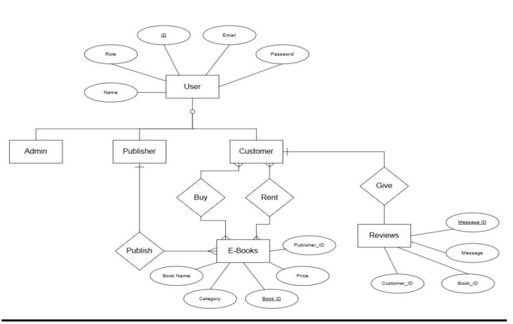
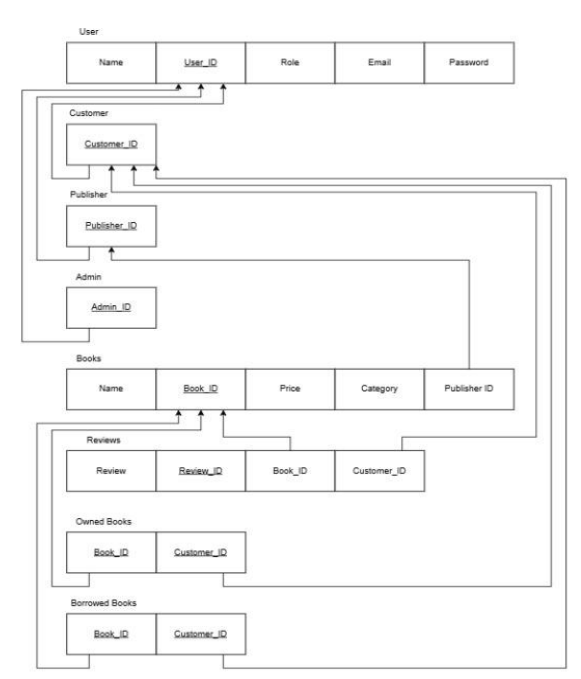
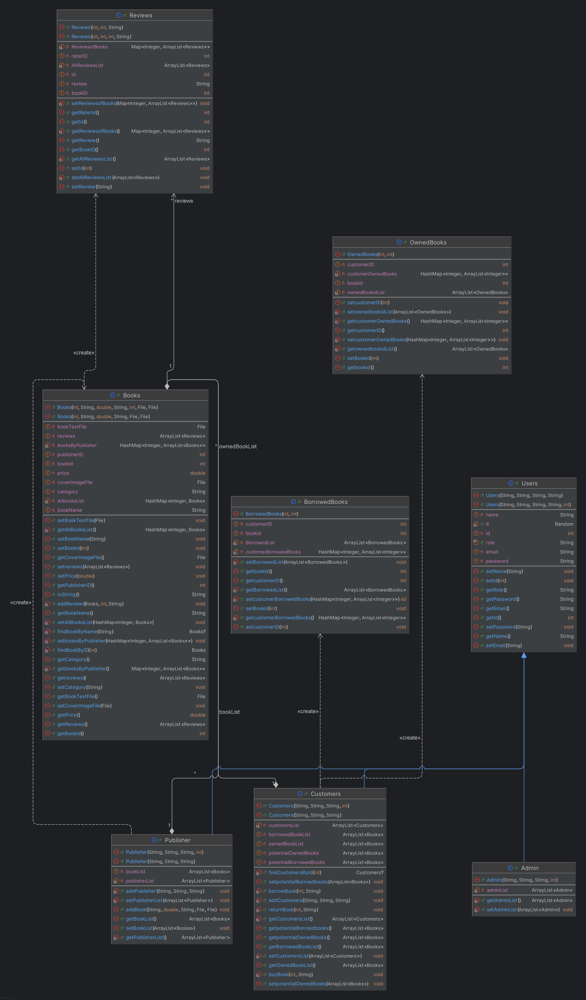
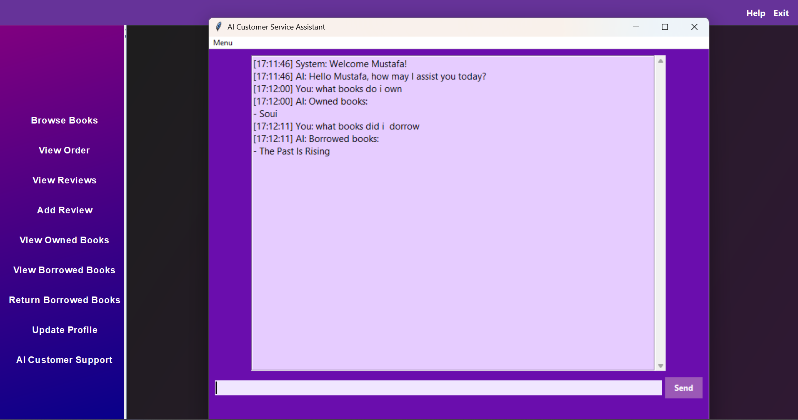

# Java E-Library System

  

## 1. Introduction
This Java E-Library System is a comprehensive library management application built using object-oriented Java programming principles. Designed to facilitate seamless management of library resources, the system provides tools for administrators and customers to handle operations including book tracking, user management, borrowing records, and publisher data.

The application is structured into modular components to promote maintainability, scalability, and clarity. With a well-defined class hierarchy and a data access layer, the system offers a robust foundation for managing both library operations and persistent data storage.

Whether you're a developer seeking to understand the architecture or an end-user wanting insight into the system’s capabilities, this documentation provides a detailed breakdown of the project.

---

## 2. Problem Statement
In traditional library systems, book management, borrowing records, and user access are handled manually or with outdated tools, leading to inefficiencies such as:

- Time-consuming book searches
- Manual borrowing/return processes prone to errors
- Poor tracking of issued and available books
- Limited accessibility for users outside of library hours

There is a growing need for a modern, digital solution that streamlines library operations and improves user experience.

---

## 3. Solution
The E-Library Desktop Application addresses these challenges by providing a comprehensive digital system for managing library resources. Developed using Java and Swing for the GUI, the system offers the following features:

- **User Authentication:** Secure login system for administrators and library users  
- **Book Management:** Add, edit, delete, and view book records  
- **User Management:** Admin panel for managing library users  
- **Borrow/Return System:** Track book issues and returns with due date management  
- **Search Functionality:** Quick search based on title, author, or ISBN  
- **Database Integration:** Uses a backend database (Microsoft SQL Server) to store persistent data  

**Benefits:**

- Improves efficiency by automating routine tasks  
- Reduces errors and redundancy in record keeping  
- Enhances accessibility for users and admins  
- Scalable for integration into larger institutional systems  

---

## 4. Tools Used
- Java (Core + Swing)  
- Python  
- Microsoft SQL Server  
- Visual Studio Code  
- GitHub: [Java Desktop E-Library APP](https://github.com/AhmedAdelMohamedAbouhussein/Java_Desktop_E-library_APP)  
- Live Server extension for Visual Studio Code  

---

## 5. ERD / RDM

*ERD*  

  

*RDM*  

  

---

## 6. Class Diagram

  

 

---

## 7. GUI Pictures
*Home page* 

  

*SignUp page* 

  

*Login page*

  

*Browse Books page*

  

*Publish Book page*

  

*Update Info page*

  

*View Book Reviews page*

  

*Search Books*

  

*Owned Books page*

  

*Return Rented Books page*

  

*Cart page*

  

*All Customers Admin page*

  

*All Publishers page*

  

*Admin Mange All Books page*

  

---

## 8. AI Implementation (Bonus)

### Overview
This AI system provides a graphical user interface (GUI) for E-Library customers to interact with their account, check book availability, manage reviews, handle wishlists, and get recommendations—all through natural language commands. It is implemented in Python (backend + UI) and launched via a Java application, which acts as a bridge between systems.

### Core Functionalities
**Natural Language Command Handling:**  
The assistant understands customer queries using keyword and fuzzy string matching (`re` and `difflib`). Customers can interact using commands like:

- What have I borrowed?  
- Recommend a book  
- Add to wishlist  
- Edit my review  

Even if users phrase things imperfectly, the AI attempts to match them with relevant commands.

### Library Services Provided

| Feature | Description |
|---------|-------------|
| Get Borrowed Books | Shows a list of books the user has borrowed from the library |
| Get Owned Books | Displays books the user has purchased or owns |
| List All Available Books | Lists all books available in the library |
| Leave, Edit, Delete Review | Allows users to write, modify, or remove book reviews |
| Publisher Information | Lists all publishers associated with the books in the database |
| Book Recommendations | Shows 5 randomly recommended books |
| Wishlist Management | View or add books to personal wishlist |

**AI GUI Picture:**  

  

---

